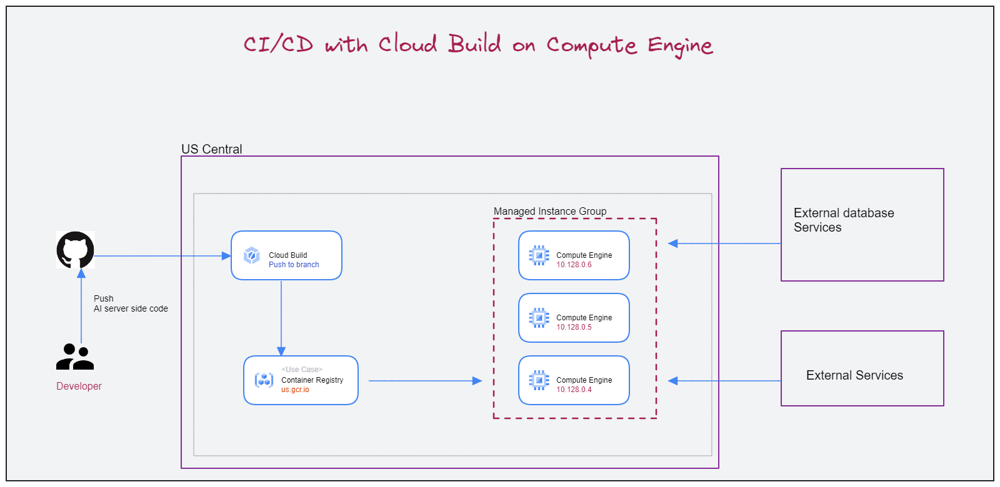

## ML in Prod (batch-1| proj2)
#### (CI-CD-With-Cloud-Build-on-Compute-Engine)




### Sample gcloud commands
```bash
gcloud compute instance-templates list 

gcloud compute instance-templates create-with-container instance-gp-tp-prod-123 --custom-cpu=2 --custom-memory=8GB --boot-disk-size=20GB --region=asia-east --container-image $_AR_HOSTNAME/$_PROJECT_ID/cloud-run-source-deploy/gce-fastapi:prod


gcloud compute instance-groups managed rolling-action start-update instance-group-prod --version=template=instance-gp-tp-prod-48c00c9 --zone=asia-east1-b
```


#### Cloud Function call test
```bash
curl -X POST https://YOUR_CLOUD_FUNCTION_URL
```