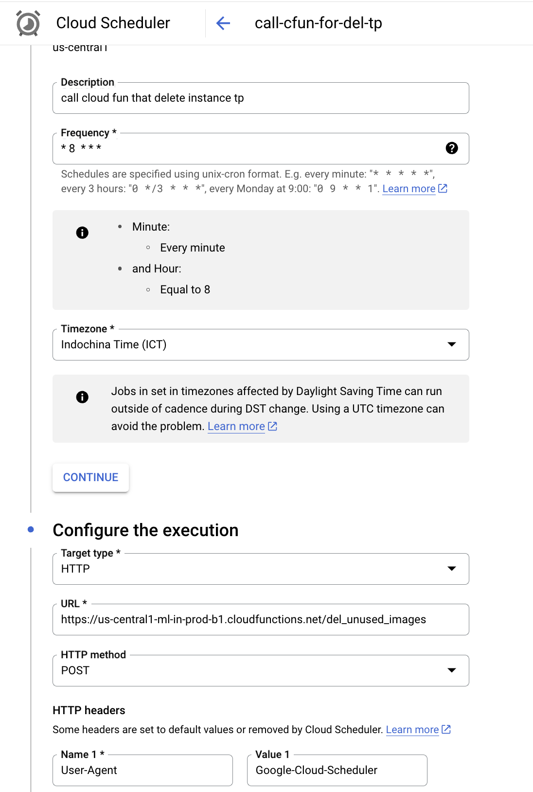

### Delete Old Instances Templates 
1. We setup the cloud-function to delete old instances template from Instance Template Group(IMG) 
2. To automatically run this cloud function we setup cloud scheduler.

### Eg: Check and delete old images at 8 am everyday 

