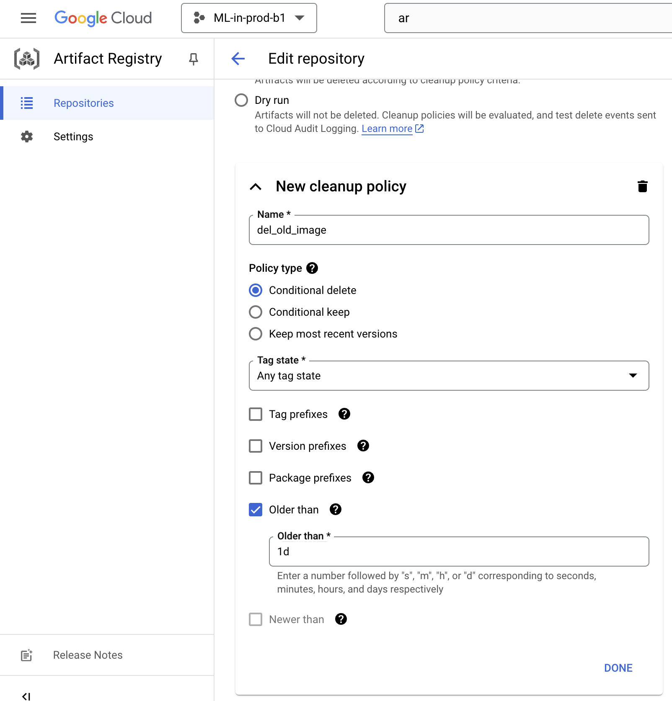
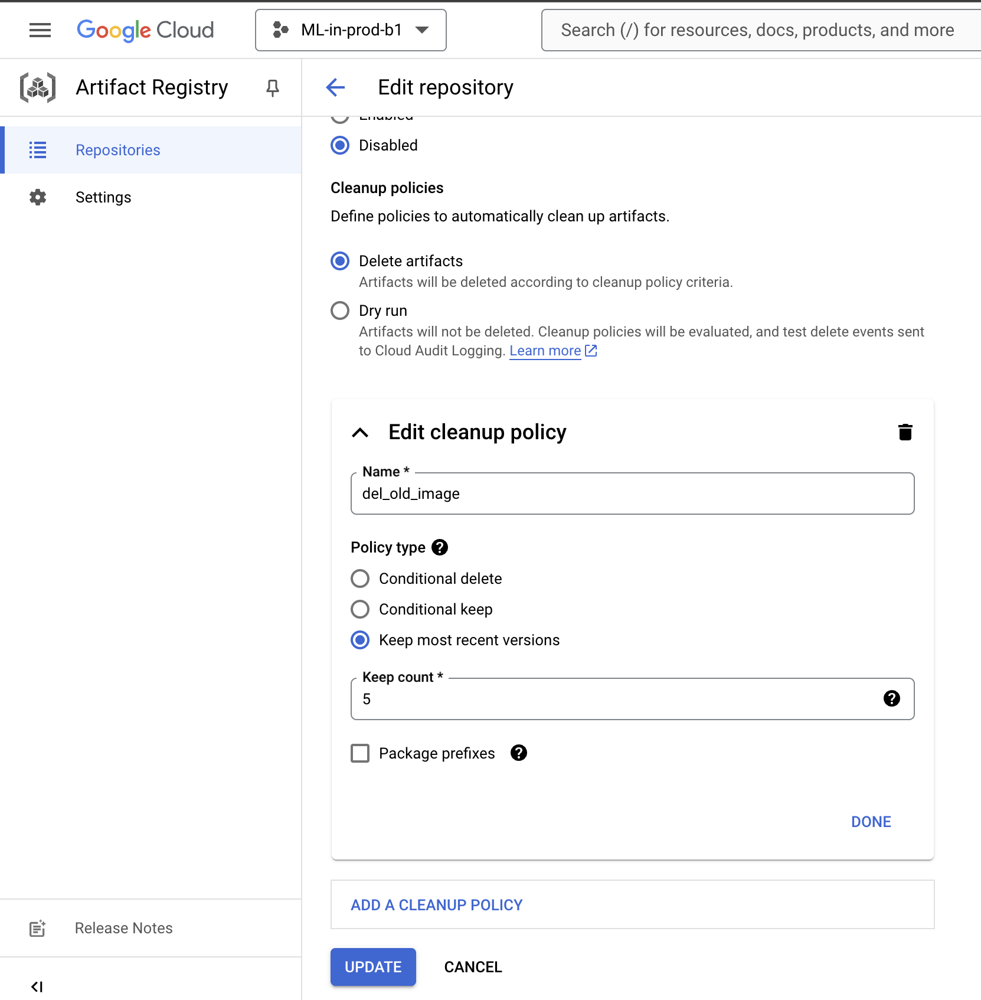

#### Delete Old images

There are two methods:
1. You can write a cloud function.
2. You can setup Clean Up Ploicy in Artifact Registry's Setting.

### Eg: Older Than 1-Day 

### Eg: Keep only latest 5 images
